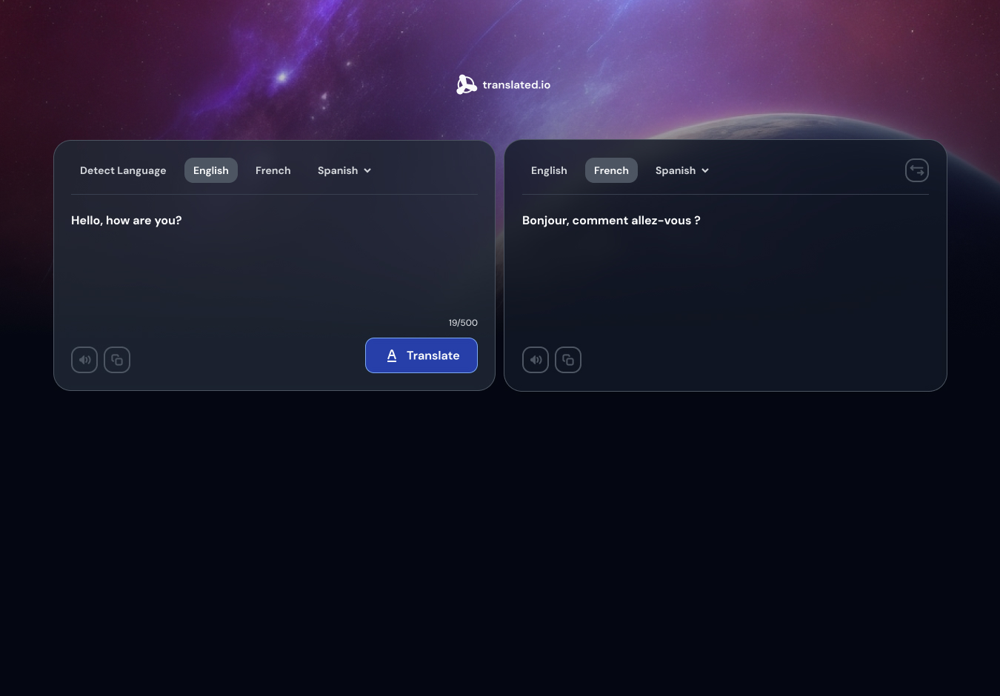

<!-- Please update value in the {}  -->

<h1 align="center">Translate App | devChallenges</h1>

<div align="center">
   This is my solution for a challenge <a href="https://devchallenges.io/challenge/translate-app" target="_blank">Translate app</a> from <a href="http://devchallenges.io" target="_blank">devChallenges.io</a>.
</div>

<div align="center">
  <h3>
    <a href="https://translate-app-thiago-thomas.netlify.app/">
      Demo
    </a>
    <span> | </span>
    <a href="https://devchallenges.io/challenge/translate-app">
      Challenge
    </a>
  </h3>
</div>

<!-- TABLE OF CONTENTS -->

## Table of Contents

- [Overview](#overview)
  - [What I learned](#what-i-learned)
  - [Useful resources](#useful-resources)
- [Built with](#built-with)
- [Features](#features)
- [Contact](#contact)
- [Acknowledgements](#acknowledgements)

<!-- OVERVIEW -->

## Overview



<!--
Introduce your projects by taking a screenshot or a gif. Try to tell visitors a story about your project by answering:

- What have you learned/improved?
- Your wisdom? :)
-->

### What I learned

- **State Management with React Hooks**: Implementing complex state management with `useState` to manage text translations, language selection, and loading states.
- **API Integration**: Integrating with external translation APIs and handling async operations with proper error handling.
- **TypeScript**: Using TypeScript interfaces to ensure type safety across API responses and component props.
- **Speech Synthesis API**: Implementing text-to-speech functionality using the Web Speech API with voice selection and language-specific handling.
- **Clipboard API**: Using the modern Clipboard API to copy text and provide user feedback via toast notifications.
- **Component Composition**: Building reusable components like the Loading spinner and organizing components in a modular structure.
- **CSS Styling**: Creating responsive layouts with flexbox and CSS grid, along with custom properties for maintainability.

### Useful resources

- [**MyMemory Translation API**](https://mymemory.translated.net/) - Free translation API used for the core translation functionality.
- [**Web Speech API - MDN**](https://developer.mozilla.org/en-US/docs/Web/API/Web_Speech_API) - Documentation for text-to-speech implementation.
- [**React Toastify**](https://fkhadra.github.io/react-toastify/introduction) - Toast notification library for user feedback.
- [**TypeScript Handbook**](https://www.typescriptlang.org/docs/) - Essential for understanding type definitions and interfaces.

### Built with

- Semantic HTML5 markup
- CSS custom properties
- Flexbox
- CSS Grid
- [React 19](https://reactjs.org/) - UI framework
- [TypeScript](https://www.typescriptlang.org/) - Type-safe JavaScript
- [Vite](https://vitejs.dev/) - Build tool and development server
- [React Toastify](https://fkhadra.github.io/react-toastify/) - Notifications
- [MyMemory API](https://mymemory.translated.net/) - Translation service

## Features

- **Real-time Translation**: Translate text between multiple languages (English, French, Spanish) using the MyMemory API
- **Auto Language Detection**: Automatically detect the language of the input text
- **Language Swap**: Quickly swap between source and target languages with a single click
- **Text-to-Speech**: Listen to both the original and translated text with natural voice synthesis (optimized for Chrome and Edge)
- **Copy Functionality**: Copy translated text to clipboard with instant feedback notifications
- **Character Counter**: Real-time character count with a 500-character limit
- **Loading Indicator**: Visual feedback during translation requests
- **Responsive Design**: Mobile-friendly interface that works across different screen sizes
- **Toast Notifications**: User-friendly notifications for copy actions and error handling

This application/site was created as a submission to a [DevChallenges](https://devchallenges.io/challenges-dashboard) challenge.

## Acknowledgements

- [DevChallenges](https://devchallenges.io/) - For providing the design specification and challenge requirements
- [MyMemory](https://mymemory.translated.net/) - For providing a free translation API
- React and TypeScript communities - For comprehensive documentation and best practices

## Getting Started

### Prerequisites
- Node.js (v16 or higher)
- npm or yarn

### Installation

1. Clone the repository
```bash
git clone https://github.com/thiago-thomas/translate-app.git
cd translate-app
```

2. Install dependencies
```bash
npm install
```

3. Start the development server
```bash
npm run dev
```

4. Build for production
```bash
npm run build
```

## Author

- GitHub [@thiago-thomas](https://github.com/thiago-thomas)
